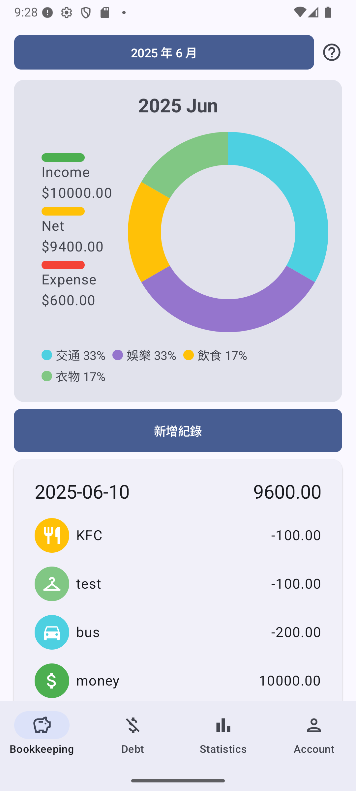
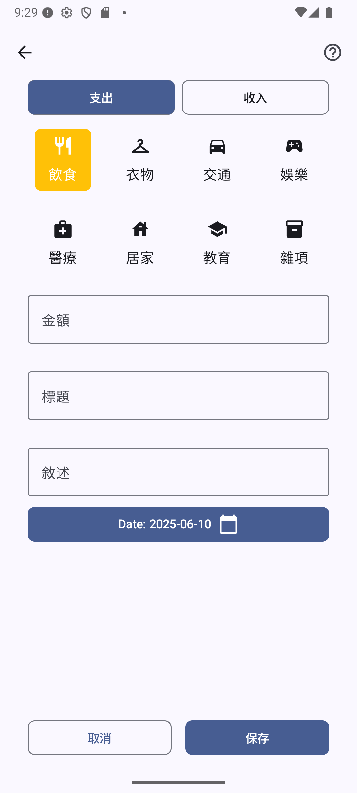
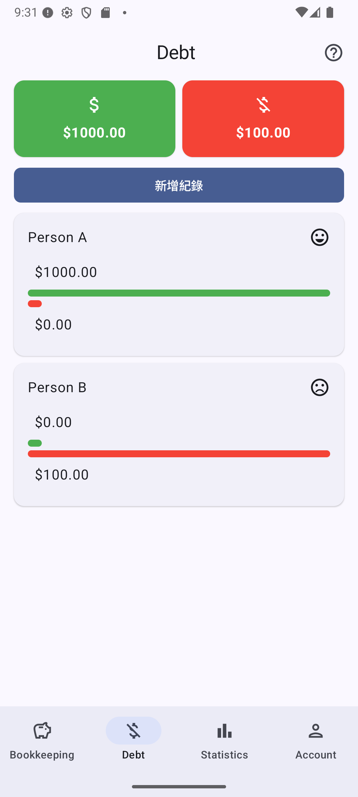
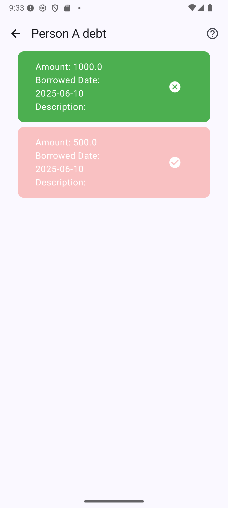
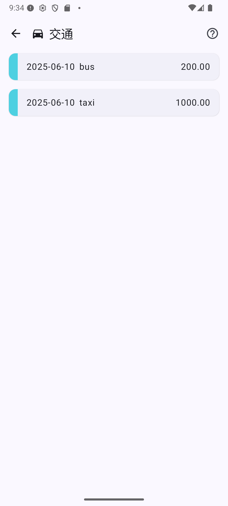

# Solo-Bookkeeping

一款記帳程式，使用 Material Design 風格來做設計。主要頁面有以下四個

- 記帳頁面
- 欠賬頁面
- 統計頁面
- 帳號頁面

## 記帳

- 圓餅圖讓用戶清楚的知道當月各類別支出佔本
- 顯示每日金流細項

<table>
  <tr>
    <td></td>
    <td></td>
  </tr>
</table>

## 欠賬

- 顯示當前獲得和借出的金額
- 顯示獲得和借出對比，讓用戶大概了解比例
- 根據獲得和借出的比例顯示不同表情，讓用戶身歷其境

<table>
  <tr>
    <td></td>
    <td></td>
  </tr>
</table>

## 統計

- 自由選擇統計時間段
- 圓餅圖搭配進度條顯示各類別的支出
- 列出時間段內該類別的全部支出

<table>
  <tr>
    <td></td>
    <td></td>
  </tr>
</table>

## 帳號

- 匯出資料 (未實作)
- 匯入資料 (未實作)
- 財金教學 (未實作)

<table>
  <tr>
    <td></td>
    <td></td>
  </tr>
</table>
